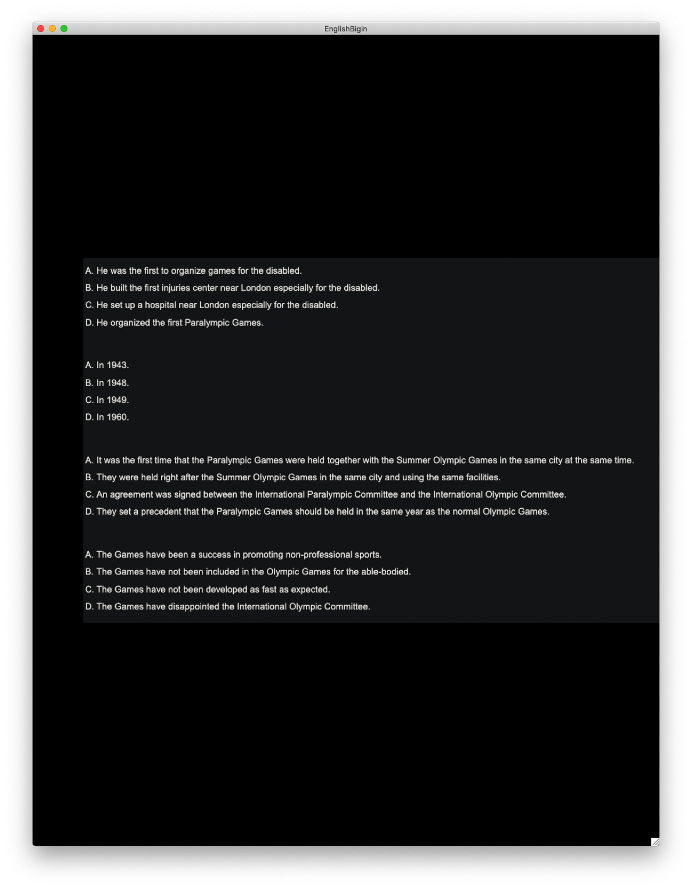

# English Bigin

by: coronaPolvo,ZeroRains

刷英语听力的神器

使用方法：

运行==》空格显示答案 ==〉方向键的左右键进行题目的切换

使用范围：大英三， 后续可以增加题库

最近考试，等考完没事了回来补一下这个readme

效果图：

不显示答案：

显示答案：

添加了判断题刷题工具：
TrueFalse_bigin.py
直接运行就行，没有导入奇怪的包

